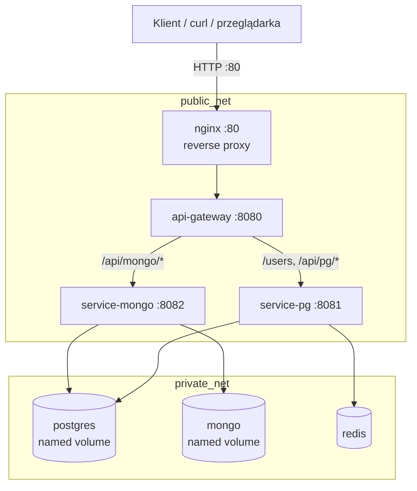

# Checklist wdrożenia DevOps — Wymiana krótkich wiadomości

Inżynierska specyfikacja realizacji wymagań infrastrukturalnych z arkusza ocen.  
Legenda: `- [x]` spełnione i zweryfikowalne w repozytorium.

---

## Diagram architektury



---

## Opis usług

| Usługa | Rola | Port na hoście | Sieć |
| --- | --- | --- | --- |
| `nginx` | Reverse proxy — jedyny publiczny punkt wejścia | `80` | `public_net` |
| `api-gateway` | Agregacja `/health`, routing HTTP do mikroserwisów | — | `public_net` |
| `service-pg` | Backend relacyjny: `users`, `conversations`; cache Redis | — | `public_net`, `private_net` |
| `service-mongo` | Backend dokumentowy: `messages`; zapis hybrydowy PG+Mongo | — | `public_net`, `private_net` |
| `postgres` | Baza relacyjna (metadane, wskaźniki wiadomości) | brak | `private_net` |
| `mongo` | Baza dokumentowa (treść wiadomości) | brak | `private_net` |
| `redis` | Cache listy użytkowników (TTL 60 s) | brak | `private_net` |
| `adminer` | Narzędzie dev (profil `dev`) | `8088` | `public_net`, `private_net` |

---

## Wymagania infrastrukturalne

- [x] **Minimum 4 usługi w `docker-compose.yml`** — 8 usług: `nginx`, `api-gateway`, `service-pg`, `service-mongo`, `postgres`, `mongo`, `redis`, `adminer` (profil `dev`). Weryfikacja: `docker compose config`, `docker compose ps`.

- [x] **Własne Dockerfile dla usług aplikacyjnych** — `services/api-gateway/Dockerfile`, `services/service-pg/Dockerfile`, `services/service-mongo/Dockerfile`.

- [x] **Multi-stage build** — `api-gateway` i `service-pg`: stage `builder` + `runner`; `service-mongo`: stage `deps` + `runner`.

- [x] **`.dockerignore`** — `services/service-pg/.dockerignore` wyklucza `node_modules`, `.env`, logi, pliki testowe.

- [x] **Aplikacja nie uruchamiona jako root** — `USER node` w Dockerfile `api-gateway` i `service-pg` (wymóg: minimum jeden Dockerfile).

- [x] **Osobne sieci zewnętrzna i wewnętrzna** — `public_net` (nginx, gateway, mikroserwisy) i `private_net` (bazy, Redis, mikroserwisy). Ruch zewnętrzny przez `nginx` na porcie `80`.

- [x] **Baza danych bez portu na hoście** — `postgres` i `mongo` nie definiują sekcji `ports:`; dostęp tylko z sieci Compose.

- [x] **Named volume dla bazy danych** — `postgres_data` → `/var/lib/postgresql/data`, `mongo_data` → `/data/db`. Dane przetrwają `docker compose down` (bez `-v`).

- [x] **`.env.example`** — zmienne dla Postgres, Mongo, Redis, portów serwisów i URL-i downstream (`SERVICE_PG_URL`, `SERVICE_MONGO_URL`).

- [x] **Dane niepoufne przez zmienne środowiskowe; hasła poza kodem** — konfiguracja w `.env` / `environment:` w compose; brak haseł w Dockerfile i kodzie źródłowym.

- [x] **Docker Compose secrets** — `secrets/postgres_password.txt`, `secrets/mongo_password.txt`; montowane jako `POSTGRES_PASSWORD_FILE`, `MONGO_INITDB_ROOT_PASSWORD_FILE`.

- [x] **Healthchecki** — `pg_isready`, `mongosh ping`, `redis-cli ping`, HTTP `fetch` w serwisach Node (`/health`).

- [x] **`depends_on: condition: service_healthy`** — łańcuch startu: DB/Redis → mikroserwisy → gateway → nginx.

- [x] **Limity CPU i pamięci** — `deploy.resources.limits` na wszystkich głównych usługach (np. postgres `1 CPU / 512M`, service-pg `0.5 CPU / 512M`).

- [x] **Rotacja logów** — `logging.driver: json-file`, `max-size: 10m`, `max-file: 3` na usługach aplikacyjnych i bazach.

- [x] **Graceful shutdown (SIGTERM) + `stop_grace_period`** — `service-pg` i `service-mongo`: handler `SIGINT`/`SIGTERM` zamyka HTTP, `prisma.$disconnect()`, pule PG, Redis/Mongo; `stop_grace_period: 15s` w compose.

- [x] **Profil deweloperski** — `adminer` z `profiles: [dev]`; uruchomienie: `docker compose --profile dev up -d`.

- [x] **Główny zasób biznesowy + `/health`** — zasób `users`: `GET /users` (lista), tworzenie danych przez `POST /api/pg/conversations`; health: `GET /health` (gateway agreguje mikroserwisy).

- [x] **Redis jako komponent wspierający** — `service-pg` cache'uje `GET /users` w Redis (`users_cache`, TTL 60 s); dowód: klucz widoczny w `redis-cli GET users_cache`.

- [x] **Persystencja danych po restarcie** — named volumes; test: dodanie rekordu → `docker compose down && docker compose up -d` → odczyt rekordu.

- [x] **Tagowanie obrazów** — obrazy budowane przez Compose: `docker compose images` → repozytoria `database-faculty-{service}`, tag `latest`; wersja semantyczna projektu: `package.json` → `1.0.0`.

---

## Instrukcja uruchomienia

### Wymagania wstępne

- Docker Desktop z `docker compose`
- Pliki haseł: `secrets/postgres_password.txt`, `secrets/mongo_password.txt` (zgodne z `.env`)

### Start (PowerShell)

```powershell
cd c:\Users\tomek\Desktop\database-faculty
Copy-Item .env.example .env -ErrorAction SilentlyContinue
docker compose config
docker compose up -d --build
docker compose exec -T service-pg npm run db:setup
docker compose exec -T service-pg npm run knex:seed
docker compose exec -T service-mongo npm run db:seed
docker compose ps
```

### Oczekiwany wynik `docker compose ps`

Wszystkie usługi ze statusem `running` i `(healthy)` przy healthcheckach (poza `nginx`, który nie ma healthchecka).

---

## Komendy testowe

### 1. Walidacja compose i status kontenerów

```powershell
docker compose config
docker compose ps
```

**Oczekiwany wynik:** brak błędów parsowania YAML; min. 7 kontenerów `running` (`nginx`, `api-gateway`, `service-pg`, `service-mongo`, `postgres`, `mongo`, `redis`).

### 2. Healthcheck zagregowany

```powershell
curl.exe -s http://localhost/health | ConvertFrom-Json | ConvertTo-Json -Depth 5
```

**Oczekiwany wynik:** HTTP `200`, JSON:

```json
{
  "status": "ok",
  "service": "api-gateway",
  "dependencies": [
    { "name": "service-pg", "ok": true, "statusCode": 200 },
    { "name": "service-mongo", "ok": true, "statusCode": 200 }
  ]
}
```

### 3. Odczyt głównego zasobu — lista użytkowników

```powershell
curl.exe -s http://localhost/users | ConvertFrom-Json | ConvertTo-Json -Depth 3
```

**Oczekiwany wynik:** HTTP `200`, `total` ≥ 3, tablica `users` z seedów (Janek, Ania, Ola):

```json
{
  "total": 3,
  "users": [
    { "email": "jan@example.com", "displayName": "Janek" },
    { "email": "anna@example.com", "displayName": "Ania" },
    { "email": "ola@example.com", "displayName": "Ola" }
  ]
}
```

### 4. Dowód działania Redis (cache)

```powershell
docker compose exec -T redis redis-cli FLUSHALL
curl.exe -s http://localhost/users > $null
docker compose exec -T redis redis-cli GET users_cache
```

**Oczekiwany wynik:** klucz `users_cache` zawiera JSON z `"total":3` i tablicą `users` — potwierdza zapis odpowiedzi w Redis po pierwszym żądaniu.

### 5. Sieci i brak ekspozycji baz

```powershell
docker compose ps --format "table {{.Name}}\t{{.Ports}}"
```

**Oczekiwany wynik:** tylko `database-faculty-nginx` ma `0.0.0.0:80->80/tcp`; `postgres`, `mongo`, `redis` bez mapowania portów na hosta.

### 6. Profil dev — Adminer

```powershell
docker compose --profile dev up -d adminer
```

**Oczekiwany wynik:** Adminer dostępny pod `http://localhost:8088`.

### 7. Obrazy aplikacyjne

```powershell
docker compose images
```

**Oczekiwany wynik:** wiersze dla `database-faculty-api-gateway`, `database-faculty-service-pg`, `database-faculty-service-mongo` z tagiem `latest`.
