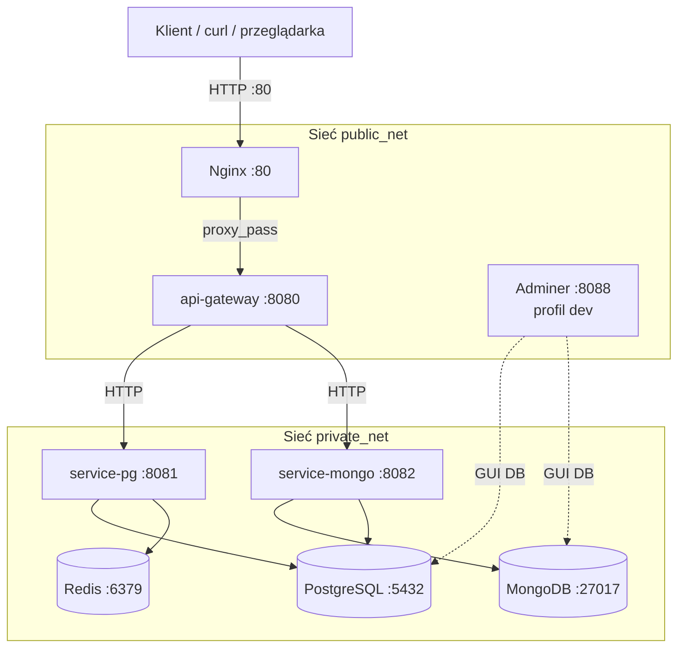

# Checklist wdrożenia — Wymiana krótkich wiadomości

Dokument potwierdza poprawność architektury kontenerowej projektu `database-faculty`: reverse proxy, API Gateway, mikroserwisy, bazy danych, Redis oraz opcjonalny profil deweloperski.

---

## 1. Diagram architektury systemu



**Przepływ żądań:** Cały ruch kliencki trafia na **Nginx** (port 80), który przekazuje go do **API Gateway**. Gateway agreguje healthchecki i routuje żądania biznesowe do mikroserwisów. `service-pg` obsługuje użytkowników i konwersacje (PostgreSQL + Redis), a `service-mongo` — wiadomości i dokumenty (MongoDB + synchronizacja metadanych w PostgreSQL).

---

## 2. Opis usług

| Usługa | Rola |
| --- | --- |
| **nginx** | Reverse proxy — jedyny publiczny punkt wejścia na porcie **80**; przekazuje żądania do `api-gateway`. |
| **api-gateway** | Agregator healthchecków i router HTTP do mikroserwisów downstream (`service-pg`, `service-mongo`). |
| **service-pg** | Mikroserwis relacyjny: użytkownicy, konwersacje, członkostwo; Prisma, Knex, pg, Sequelize; cache Redis. |
| **service-mongo** | Mikroserwis dokumentowy: wiadomości, załączniki, agregacje MongoDB; operacje hybrydowe z PostgreSQL. |
| **postgres** | Baza relacyjna — trwałe metadane (users, conversations, members, message_pointers). Dane w wolumenie `postgres_data`. |
| **mongo** | Baza dokumentowa — treść wiadomości i metadane dokumentów. Dane w wolumenie `mongo_data`. |
| **redis** | Cache in-memory (np. lista użytkowników) — przyspiesza odczyty w `service-pg`. |
| **adminer** *(profil `dev`)* | Lekki panel WWW do podglądu PostgreSQL i MongoDB pod adresem `http://localhost:8088` — uruchamiany tylko w trybie deweloperskim. |

---

## 3. Instrukcja uruchomienia środowiska

### Wymagania wstępne

- Docker Desktop (lub Docker Engine) z obsługą `docker compose`
- Pliki sekretów w katalogu `secrets/` (hasła do baz)
- Plik `.env` na podstawie `.env.example`

### Przygotowanie (jednorazowo)

```powershell
cd C:\Users\tomek\Desktop\database-faculty
Copy-Item .env.example .env
```

Upewnij się, że istnieją pliki:

- `secrets/postgres_password.txt`
- `secrets/mongo_password.txt`

### Uruchomienie podstawowe (bez profilu dev)

```powershell
docker compose up -d --build
```

Po starcie kontenerów wykonaj migracje i seedy (wymagane do testu `/users`):

```powershell
docker compose exec -T service-pg npm run db:setup
docker compose exec -T service-pg npm run knex:seed
docker compose exec -T service-mongo npm run db:seed
```

Sprawdzenie statusu:

```powershell
docker compose ps
```

### Uruchomienie z profilem deweloperskim (Adminer)

Profil `dev` dodaje kontener **Adminer** (panel baz danych na porcie **8088**):

```powershell
docker compose --profile dev up -d --build
```

Następnie wykonaj migracje i seedy jak powyżej.

Adminer dostępny pod: **http://localhost:8088**

Przykładowe logowanie do PostgreSQL w Adminerze:

| Pole | Wartość |
| --- | --- |
| System | PostgreSQL |
| Serwer | `postgres` |
| Użytkownik | `chat_user` |
| Hasło | *(z pliku `secrets/postgres_password.txt`)* |
| Baza | `chat_app` |

### Zatrzymanie środowiska

```powershell
docker compose down
```

Z profilem dev (zatrzymuje również Adminer):

```powershell
docker compose --profile dev down
```

---

## 4. Komendy testowe `curl` (port 80 — Nginx)

Wszystkie żądania trafiają przez Nginx na porcie **80**.

### Healthcheck aplikacji

```powershell
curl -s http://localhost/health
```

**Oczekiwany wynik:** status HTTP `200`, JSON z polem `"status": "ok"` oraz listą zależności (`service-pg`, `service-mongo`).

Przykład:

```json
{
  "status": "ok",
  "service": "api-gateway",
  "dependencies": [
    { "name": "service-pg", "ok": true, "statusCode": 200 },
    { "name": "service-mongo", "ok": true, "statusCode": 200 }
  ]
}
```

### Lista użytkowników (wymóg biznesowy)

```powershell
curl -s http://localhost/users
```

**Oczekiwany wynik:** status HTTP `200`, JSON z polami `total` i `users` (tablica użytkowników z seedów, np. Janek, Ania, Ola).

Przykład:

```json
{
  "total": 3,
  "users": [
    { "id": "...", "email": "jan@example.com", "displayName": "Janek" },
    { "id": "...", "email": "anna@example.com", "displayName": "Ania" },
    { "id": "...", "email": "ola@example.com", "displayName": "Ola" }
  ]
}
```

> **Uwaga:** Przed testem `/users` upewnij się, że wykonano migracje i seedy (sekcja 3).

---

## 5. Test przetrwania danych (named volumes)

Celem testu jest udowodnienie, że dane w PostgreSQL i MongoDB przetrwają restart całego środowiska dzięki wolumenom `postgres_data` i `mongo_data`.

### Krok 1 — Uruchom środowisko i załaduj dane

```powershell
docker compose up -d --build
docker compose exec -T service-pg npm run db:setup
docker compose exec -T service-pg npm run knex:seed
docker compose exec -T service-mongo npm run db:seed
```

### Krok 2 — Zapisz dodatkowy rekord w PostgreSQL

Wstaw nowego użytkownika bezpośrednio do bazy (dowód trwałości wolumenu `postgres_data`):

```powershell
docker compose exec -T postgres psql -U chat_user -d chat_app -c "INSERT INTO users (id, email, display_name) VALUES ('44444444-4444-4444-8444-444444444444', 'test@example.com', 'TestUser') ON CONFLICT DO NOTHING;"
```

### Krok 3 — Potwierdź obecność danych przed restartem

```powershell
curl -s http://localhost/users
```

Zapisz wynik — lista powinna zawierać użytkownika `TestUser` (`test@example.com`) oraz użytkowników z seedów.

Opcjonalnie sprawdź MongoDB (liczba dokumentów wiadomości):

```powershell
docker compose exec -T mongo mongosh --quiet -u chat_root -p $(Get-Content secrets/mongo_password.txt) --authenticationDatabase admin chat_messages --eval "db.messages.countDocuments()"
```

### Krok 4 — Zatrzymaj i uruchom ponownie całe środowisko

```powershell
docker compose down
docker compose up -d
```

> **Ważne:** Nie używaj flagi `-v` przy `docker compose down` — usunęłaby named volumes i zniszczyła dane testowe.

### Krok 5 — Potwierdź przetrwanie danych po restarcie

```powershell
curl -s http://localhost/users
```

**Oczekiwany wynik:** Ten sam zestaw użytkowników co w kroku 3, w tym `TestUser` — dane przetrwały restart dzięki wolumenowi `postgres_data`.

Ponowna weryfikacja MongoDB:

```powershell
docker compose exec -T mongo mongosh --quiet -u chat_root -p $(Get-Content secrets/mongo_password.txt) --authenticationDatabase admin chat_messages --eval "db.messages.countDocuments()"
```

Liczba dokumentów powinna być identyczna jak przed restartem — dane przetrwały dzięki wolumenowi `mongo_data`.

### Krok 6 — Weryfikacja wolumenów (opcjonalnie)

```powershell
docker volume ls | Select-String "database-faculty"
```

Powinny być widoczne m.in.:

- `database-faculty_postgres_data`
- `database-faculty_mongo_data`

---

## Podsumowanie spełnionych wymogów architektonicznych

| Wymaganie | Status |
| --- | --- |
| `docker compose up` bez kroków ręcznych (kontenery) | ✅ |
| Multi-stage Dockerfile, healthchecki, `depends_on: service_healthy` | ✅ |
| Min. 2 mikroserwisy Node w osobnych kontenerach | ✅ (`service-pg`, `service-mongo`) |
| API Gateway + Nginx reverse proxy | ✅ |
| PostgreSQL + MongoDB + Redis | ✅ |
| Named volumes (`postgres_data`, `mongo_data`) | ✅ |
| Profil deweloperski Docker (`--profile dev`) + Adminer | ✅ |
| Testy `curl` przez port 80 (`/health`, `/users`) | ✅ |
| Test przetrwania danych po `down` / `up` | ✅ |
