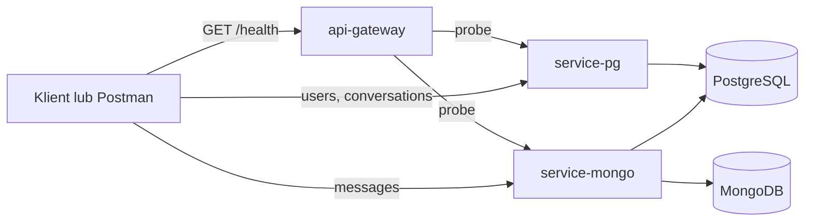

# Wymiana krotkich wiadomosci

Mikroserwisowy backend czatu oparty o PostgreSQL i MongoDB.

Cel projektu:
- PostgreSQL przechowuje trwale metadane: userow, konwersacje, czlonkostwo i porzadek wiadomosci.
- MongoDB przechowuje tresc wiadomosci i zalaczniki jako dokumenty.
- `POST /messages` zapisuje dokument w MongoDB i synchronizuje metadane rozmowy w PostgreSQL.
- API Gateway agreguje healthchecki i jest przygotowane pod dalsze proxy HTTP.

## Stos technologiczny

- Node.js 20+
- Express 4
- PostgreSQL 16
- MongoDB 7
- Prisma
- Knex
- pg
- Sequelize v6
- Mongoose
- MongoDB native driver
- Docker Compose

## Podzial serwisow

| Serwis | Port | Odpowiedzialnosc |
| --- | --- | --- |
| `api-gateway` | `8080` | Health aggregator i przyszly punkt wejscia pod proxy |
| `service-pg` | `8081` | Userzy, konwersacje, czlonkostwo, relacyjna logika biznesowa |
| `service-mongo` | `8082` | Wiadomosci, zalaczniki, dokumenty MongoDB i hybrydowa synchronizacja metadanych |
| `postgres` | `5432` | Trwale metadane relacyjne |
| `mongo` | `27017` | Dokumenty wiadomosci |

## Jak uruchomic projekt

### Wymagania

- Docker Desktop lub inny Docker z `docker compose`
- Node.js 20+ tylko jesli chcesz odpalac skrypty npm poza kontenerami

### Pelny start przez Docker Compose

1. Utworz lokalny plik `.env` na podstawie [.env.example](.env.example).
2. Uruchom kontenery.
3. Wykonaj migracje i seed danych.

Przyklad dla PowerShell:

```powershell
Copy-Item .env.example .env
docker compose up -d --build
docker compose exec -T service-pg npm run db:setup
docker compose exec -T service-pg npm run knex:seed
docker compose exec -T service-mongo npm run db:seed
```

Przydatne komendy:

```powershell
npm run compose:up
npm run compose:down
npm run compose:logs
```

Wazna uwaga:
- `docker compose up` uruchamia serwisy, ale obecnie nie robi automatycznie migracji i seedow.
- Po czystym starcie bazy trzeba wykonac setup i seedy recznie albo skorzystac z helperow.

### Szybki workflow seedowania

Repo ma tez helper pod dane testowe:

```powershell
npm run db:seed:chat
```

Ten skrypt przygotowuje `service-pg` i `service-mongo` oraz laduje seed rozmow i wiadomosci.

## Zmienne srodowiskowe

Najwazniejsze zmienne sa w [.env.example](.env.example).

| Zmienna | Znaczenie |
| --- | --- |
| `POSTGRES_DB`, `POSTGRES_USER`, `POSTGRES_PASSWORD` | Konfiguracja bazy PostgreSQL |
| `DATABASE_URL` | Glowny connection string dla `service-pg` |
| `MONGO_INITDB_ROOT_USERNAME`, `MONGO_INITDB_ROOT_PASSWORD` | Konto root MongoDB |
| `MONGO_URI` | Connection string dla `service-mongo` |
| `API_GATEWAY_PORT`, `SERVICE_PG_PORT`, `SERVICE_MONGO_PORT` | Porty serwisow Node |
| `SERVICE_PG_URL`, `SERVICE_MONGO_URL` | URL-e downstreamow dla gatewaya |
| `NODE_ENV` | Tryb uruchomienia |

## Przeplyw danych PG / Mongo

Aktualny stan architektury:
- requesty biznesowe ida bezposrednio do `service-pg` i `service-mongo`,
- `api-gateway` agreguje healthchecki,
- docelowo routing biznesowy ma przejsc przez gateway.
- przy `POST /messages` `service-mongo` zapisuje wiadomosc w MongoDB, a potem aktualizuje `last_message_at`, `next_message_seq` i `message_pointers` w PostgreSQL.



## Seed danych testowych

Stale identyfikatory przydatne do testow sa tez zapisane w kolekcji Postmana [postman/database-faculty.postman_collection.json](postman/database-faculty.postman_collection.json).

| Nazwa | Wartosc |
| --- | --- |
| `creatorUserId` | `22222222-2222-4222-8222-222222222222` |
| `memberUserId` | `11111111-1111-4111-8111-111111111111` |
| `thirdUserId` | `33333333-3333-4333-8333-333333333333` |
| `directConversationId` | `aaaaaaaa-aaaa-4aaa-8aaa-aaaaaaaaaaaa` |
| `groupConversationId` | `bbbbbbbb-bbbb-4bbb-8bbb-bbbbbbbbbbbb` |

## Kontrakt REST

To nie jest OpenAPI 3.x, ale jest rownowazna lista endpointow z przykladowymi zadaniami i odpowiedziami.

### API Gateway

| Metoda | Sciezka | Opis |
| --- | --- | --- |
| `GET` | `/` | Opis gatewaya i lista tras |
| `GET` | `/health` | Agregacja healthcheckow `service-pg` i `service-mongo` |

### service-pg

| Metoda | Sciezka | Opis |
| --- | --- | --- |
| `GET` | `/` | Opis serwisu PostgreSQL |
| `GET` | `/health` | Health wszystkich warstw: pg, knex, prisma, sequelize |
| `GET` | `/users` | Lista userow |
| `GET` | `/users/:userId/conversations` | Lista konwersacji usera, sort po `lastMessageAt desc`, potem `createdAt desc` |
| `POST` | `/conversations` | Tworzenie konwersacji `DIRECT` lub `GROUP` |
| `POST` | `/conversations/:conversationId/members` | Dodawanie nowych czlonkow do `GROUP` przez `OWNER` lub `ADMIN` |

### service-mongo

| Metoda | Sciezka | Opis |
| --- | --- | --- |
| `GET` | `/` | Opis serwisu Mongo |
| `GET` | `/health` | Health native drivera, Mongoose i prostego polaczenia `pg` |
| `GET` | `/analytics/messages/daily` | Endpoint analityczny MongoDB liczacy statystyki dzienne dla jednej konwersacji przez `aggregate(...)` i self-`$lookup` |
| `GET` | `/messages/native-search` | Natywne wyszukiwanie MongoDB przez `MongoClient` z operatorami `$in`, `$text`, `$gte` i `$lte` |
| `POST` | `/messages` | Hybrydowy zapis wiadomosci: MongoDB + synchronizacja metadanych w PostgreSQL |
| `GET` | `/messages` | Lista wiadomosci dla `conversationId` z `limit`, `offset`, `sort` |

## Przykladowe requesty i odpowiedzi

### GET /users

Request:

```http
GET /users
```

Przykladowa odpowiedz `200`:

```json
{
	"total": 3,
	"users": [
		{
			"id": "22222222-2222-4222-8222-222222222222",
			"email": "anna@example.com",
			"displayName": "Ania",
			"createdAt": "2026-05-04T12:00:00.000Z",
			"updatedAt": "2026-05-04T12:00:00.000Z"
		}
	]
}
```

### GET /users/:userId/conversations

Request:

```http
GET /users/22222222-2222-4222-8222-222222222222/conversations
```

Przykladowa odpowiedz `200`:

```json
{
	"user": {
		"id": "22222222-2222-4222-8222-222222222222",
		"email": "anna@example.com",
		"displayName": "Ania",
		"createdAt": "2026-05-04T12:00:00.000Z",
		"updatedAt": "2026-05-04T12:00:00.000Z"
	},
	"total": 2,
	"sort": {
		"primary": "lastMessageAt desc",
		"fallback": "createdAt desc"
	},
	"conversations": [
		{
			"id": "bbbbbbbb-bbbb-4bbb-8bbb-bbbbbbbbbbbb",
			"type": "GROUP",
			"title": "Projekt zespolowy",
			"createdById": "22222222-2222-4222-8222-222222222222",
			"createdAt": "2026-05-04T12:00:00.000Z",
			"updatedAt": "2026-05-04T12:00:00.000Z",
			"lastMessageAt": null,
			"memberCount": 2,
			"members": []
		}
	]
}
```

### POST /conversations

Request:

```json
{
	"createdById": "22222222-2222-4222-8222-222222222222",
	"type": "GROUP",
	"title": "Grupa testowa z README",
	"memberIds": [
		"11111111-1111-4111-8111-111111111111"
	]
}
```

Przykladowa odpowiedz `201`:

```json
{
	"conversation": {
		"id": "generated-id",
		"type": "GROUP",
		"title": "Grupa testowa z README",
		"createdById": "22222222-2222-4222-8222-222222222222",
		"createdAt": "2026-05-17T10:00:00.000Z",
		"lastMessageAt": null,
		"members": [
			{
				"userId": "22222222-2222-4222-8222-222222222222",
				"role": "OWNER"
			},
			{
				"userId": "11111111-1111-4111-8111-111111111111",
				"role": "MEMBER"
			}
		]
	}
}
```

### POST /conversations/:conversationId/members

Request:

```json
{
	"addedByUserId": "22222222-2222-4222-8222-222222222222",
	"userIds": [
		"33333333-3333-4333-8333-333333333333"
	]
}
```

Przykladowa odpowiedz `201`:

```json
{
	"message": "Uzytkownicy zostali pomyslnie dodani.",
	"addedMembers": [
		{
			"userId": "33333333-3333-4333-8333-333333333333",
			"role": "MEMBER",
			"joinedAt": "2026-05-17T10:05:00.000Z",
			"user": {
				"email": "ola@example.com",
				"displayName": "Ola"
			}
		}
	],
	"skippedUserIds": []
}
```

### POST /messages

Request:

```json
{
	"conversationId": "bbbbbbbb-bbbb-4bbb-8bbb-bbbbbbbbbbbb",
	"authorId": "22222222-2222-4222-8222-222222222222",
	"body": "Pierwsza wiadomosc testowa z README",
	"attachments": [
		{
			"name": "brief.txt",
			"mimeType": "text/plain",
			"size": 128,
			"storageKey": "attachments/brief.txt"
		}
	]
}
```

Przykladowa odpowiedz `201`:

```json
{
	"message": {
		"id": "mongo-object-id",
		"conversationId": "bbbbbbbb-bbbb-4bbb-8bbb-bbbbbbbbbbbb",
		"authorId": "22222222-2222-4222-8222-222222222222",
		"body": "Pierwsza wiadomosc testowa z README",
		"deliveryStatus": "STORED",
		"attachments": [
			{
				"name": "brief.txt",
				"mimeType": "text/plain",
				"size": 128,
				"storageKey": "attachments/brief.txt"
			}
		],
		"createdAt": "2026-05-17T10:10:00.000Z",
		"editedAt": null
	},
	"postgres": {
		"synced": true,
		"sequence": 1
	}
}
```

Przykladowa odpowiedz `403` dla usera spoza rozmowy:

```json
{
	"error": "Nie mozna wyslac wiadomosci do konwersacji bez czlonkostwa.",
	"code": "FORBIDDEN"
}
```

### GET /messages?conversationId=...&limit=20&offset=0&sort=asc

Przykladowa odpowiedz `200`:

```json
{
	"conversationId": "bbbbbbbb-bbbb-4bbb-8bbb-bbbbbbbbbbbb",
	"sort": "asc",
	"items": [
		{
			"id": "mongo-object-id",
			"conversationId": "bbbbbbbb-bbbb-4bbb-8bbb-bbbbbbbbbbbb",
			"authorId": "22222222-2222-4222-8222-222222222222",
			"body": "Pierwsza wiadomosc testowa z README",
			"deliveryStatus": "STORED",
			"attachments": [],
			"createdAt": "2026-05-17T10:10:00.000Z",
			"editedAt": null
		}
	],
	"pagination": {
		"limit": 20,
		"offset": 0,
		"total": 1,
		"hasMore": false
	}
}
```

### GET /analytics/messages/daily?conversationId=...&timezone=UTC

Request:

```http
GET /analytics/messages/daily?conversationId=bbbbbbbb-bbbb-4bbb-8bbb-bbbbbbbbbbbb&timezone=UTC
```

Przykladowa odpowiedz `200`:

```json
{
	"conversationId": "bbbbbbbb-bbbb-4bbb-8bbb-bbbbbbbbbbbb",
	"timezone": "UTC",
	"days": [
		{
			"day": "2026-05-17",
			"messageCount": 2,
			"latestMessage": {
				"authorId": "11111111-1111-4111-8111-111111111111",
				"body": "Odpowiedz na wiadomosc z danego dnia.",
				"createdAt": "2026-05-17T10:20:00.000Z"
			}
		}
	]
}
```

### GET /messages/native-search?conversationIds=...&q=...&from=...&to=...

Request:

```http
GET /messages/native-search?conversationIds=aaaaaaaa-aaaa-4aaa-8aaa-aaaaaaaaaaaa,bbbbbbbb-bbbb-4bbb-8bbb-bbbbbbbbbbbb&q=seeded&from=2026-05-16T00:00:00.000Z&to=2026-05-17T23:59:59.999Z&limit=10
```

Przykladowa odpowiedz `200`:

```json
{
	"engine": "mongodb-native-driver",
	"operatorsUsed": ["$in", "$text", "$gte", "$lte"],
	"limit": 10,
	"items": [
		{
			"id": "mongo-object-id",
			"conversationId": "bbbbbbbb-bbbb-4bbb-8bbb-bbbbbbbbbbbb",
			"authorId": "22222222-2222-4222-8222-222222222222",
			"body": "1 seeded wiadomosc w grupie projektowej.",
			"attachments": [],
			"createdAt": "2026-05-16T11:00:00.000Z"
		}
	]
}
```

### Format bledow

Glowny format bledow w endpointach biznesowych:

```json
{
	"error": "Opis bledu",
	"code": "ERROR_CODE",
	"details": {}
}
```

## Testowanie

- Gotowa kolekcja Postmana: [postman/database-faculty.postman_collection.json](postman/database-faculty.postman_collection.json)
- Najwygodniej zaczac od `GET /users`, potem `GET /users/:userId/conversations`, a na koncu testowac `POST /conversations` i `POST /messages`.
- Do sprawdzenia nowej logiki hybrydowej jest tez wygodny scenariusz: `POST /messages`, a potem `GET /users/:userId/conversations` i kontrola `lastMessageAt`.
- Do sprawdzenia natywnego Mongo najlepiej odpalic `GET /messages/native-search`, bo ten endpoint pokazuje osobno uzycie `MongoClient` oraz operatorow `$in`, `$text`, `$gte`, `$lte`.


## Bezpieczenstwo i znane ograniczenia

Co jest juz teraz:
- podstawowa walidacja wejscia w endpointach,
- brak zwracania stack trace do klienta,
- ujednolicony format odpowiedzi bledu.

Najwazniejsze obecne ryzyka i braki:
- brak autoryzacji i uwierzytelniania,
- brak rate limitingu i brak dodatkowych zabezpieczen HTTP,
- brak pelnego mapowania wszystkich bledow PostgreSQL i MongoDB na statusy HTTP,
- `api-gateway` nie proxy'uje jeszcze requestow biznesowych,
- dane z `.env.example` sa developerskie i nie powinny byc uzywane 1:1 na produkcji.

## Co jeszcze nie jest domkniete

- brak testow integracyjnych / e2e,
- brak endpointu Knex z dynamicznym `where`,
- brak hooka domenowego w Sequelize.